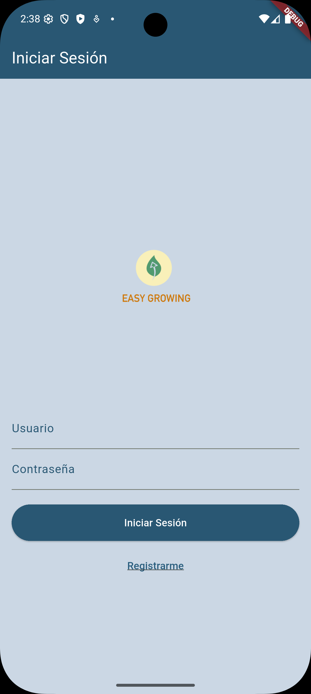
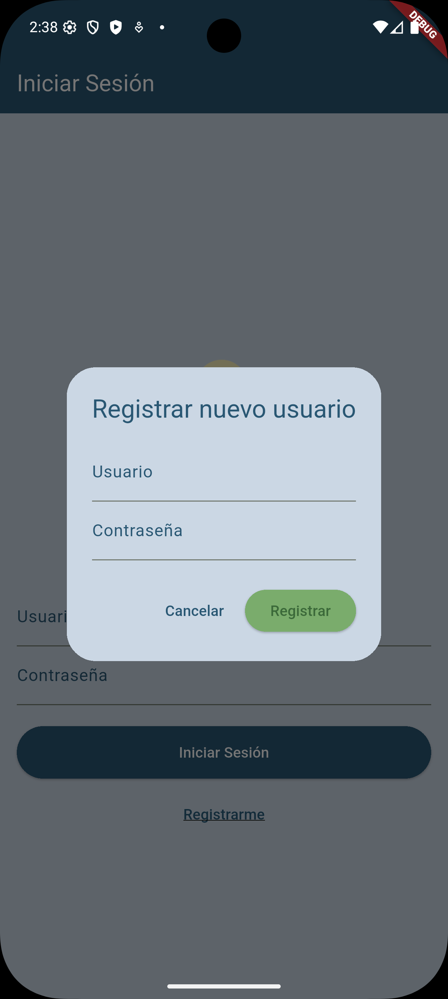
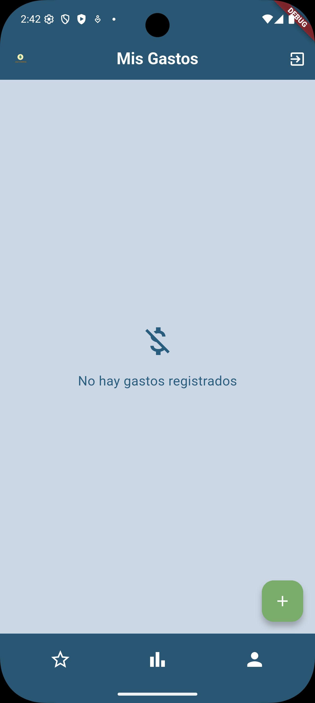
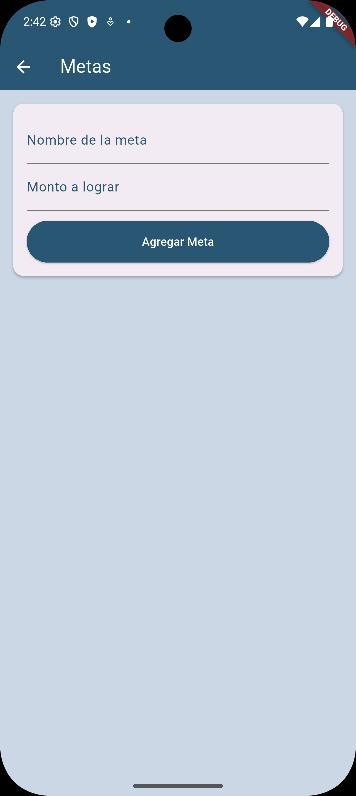
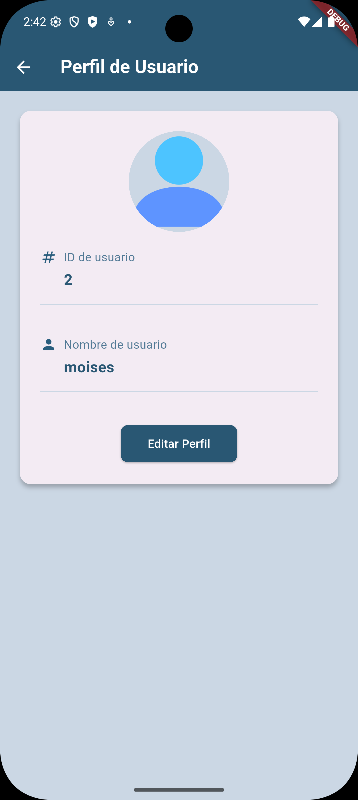
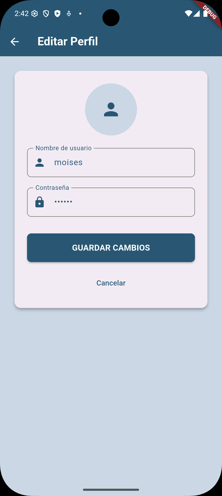
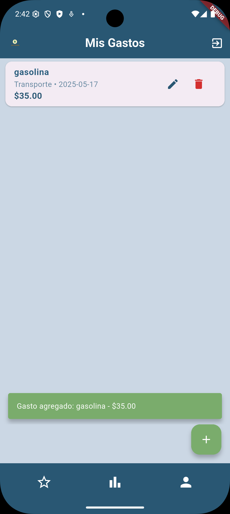
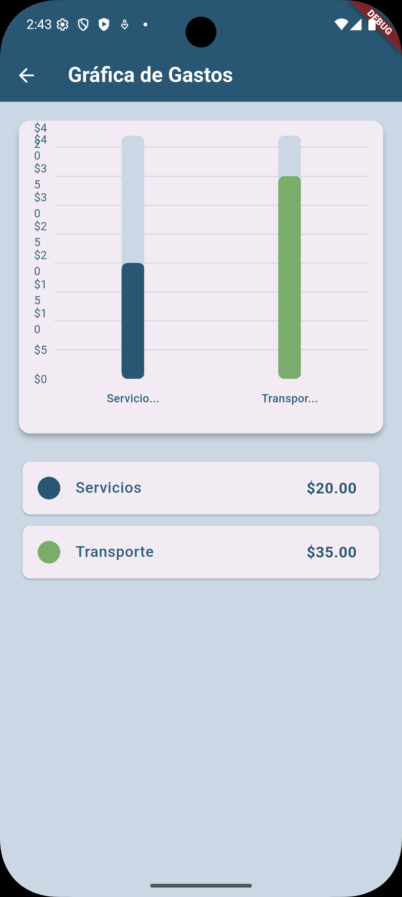

# 🌱 Easy Growing 


Aplicación móvil para gestión de gastos personales, metas financieras y seguimiento de presupuestos. Desarrollada con Flutter para Android e iOS.

## 🛠️ ¿Por qué Flutter?

Elegí **Flutter** como framework principal para el desarrollo de *Easy Growing* debido a sus múltiples ventajas en el desarrollo móvil multiplataforma:

- **Desarrollo multiplataforma con un solo código base**: Flutter permite crear aplicaciones nativas tanto para Android como iOS utilizando un mismo código fuente, lo que ahorra tiempo y recursos en el desarrollo y mantenimiento.


## ✨ Características Principales

- 📊 Registro y categorización de gastos  
- 🎯 Establecimiento de metas financieras  
- 📈 Gráficos y estadísticas de gastos  
- 👤 Perfil de usuario personalizable  
- 🔐 Autenticación segura  
- 📱 Diseño responsive y amigable  

## ✨ Pantallas de aplicacion

<div>
  
  <p>Pantalla de inicio de sesión para acceder a la aplicación de forma segura.</p>

  
  <p>Pantalla de registro para nuevos usuarios.</p>

  
  <p>Pantalla principal cuando no se ha registrado ningún gasto.</p>

  
  <p>Formulario de agregar una nueva meta.</p>

  
  <p>Perfil de usuario.</p>

  
  <p>Formulario de actualizar informacion de usuario.</p>

  
  <p>Historial detallado de transacciones y gastos registrados.</p>

  
  <p>Panel de estadísticas segun categoria  </p>
</div>


## 📲 Prueba Nuestra Aplicación

Puedes descargar el archivo APK desde el siguiente enlace:

👉 [Descargar Easy Growing (.apk)](https://drive.google.com/file/d/1Uay-XJqF_RltiZuBPT6p9p94x4a1jHgd/view?usp=sharing)


## 🎨 Paleta de Colores

| Color             | Hex       |
|-------------------|-----------|
| Azul Principal    | `#295773` |
| Azul Oscuro       | `#295D7D` |
| Fondo Claro       | `#CBD7E4` |
| Fondo Secundario  | `#F3EBF3` |
| Verde Éxito       | `#7AAC6C` |

###
###

## 🛠 Tecnologías Utilizadas

- **Flutter** (Framework multiplataforma)  
- **Dart** (Lenguaje de programación)  
- **Shared Preferences** (Almacenamiento local)  
- **FL Chart** (Gráficos y visualizaciones)  
- **Provider** (Gestión de estado)  
- **SQLite** (Base de datos)  

<div align="left">
  
  
  
  
  
</div>

## 📦 Estructura del Proyecto

<pre>
easy_growing/
├── android/        # Configuración para Android
├── assets/         # Recursos gráficos, imágenes y fuentes
├── ios/            # Configuración para iOS
├── lib/            # Código fuente principal
│   ├── db/         # Base de datos
│   ├── models/     # Modelos de datos
│   ├── screens/    # Pantallas de la aplicación
│   ├── services/   # Lógica de negocio
│   └── main.dart   # Punto de entrada de la aplicación
└── test/           # Pruebas unitarias
</pre>


## 🚀 Cómo Empezar

### Requisitos Previos
- Flutter SDK 
- Dart SDK  
- Dispositivo o emulador Android/iOS  

### Instalación
```bash
git clone https://github.com/moisescorado91/easy_growing.git
cd easy_growing
flutter pub get
flutter run
```

## 👨‍💻 Autores

Desarrollado por un equipo de 5 integrantes:

- **Moisés Isaac Molina Corado** – [@moisescorado91](https://github.com/moisescorado91)  
- **José Obany Bernal** – [@obanyBernal](https://github.com/obanyBernal)  
- **Lina Estefani Peraza Arévalo** – [@linaperaza](https://github.com/linaperaza)  
- **Alexandra Carolina Alarcón Panameño** – [@Alexalarconp](https://github.com/Alexalarconp)  
- **Luis Alberto Hernández Gómez** – [@luishgom](https://github.com/luishgom)

> Este proyecto fue desarrollado en conjunto, promoviendo el trabajo colaborativo, la organización en equipo y el aprendizaje compartido.